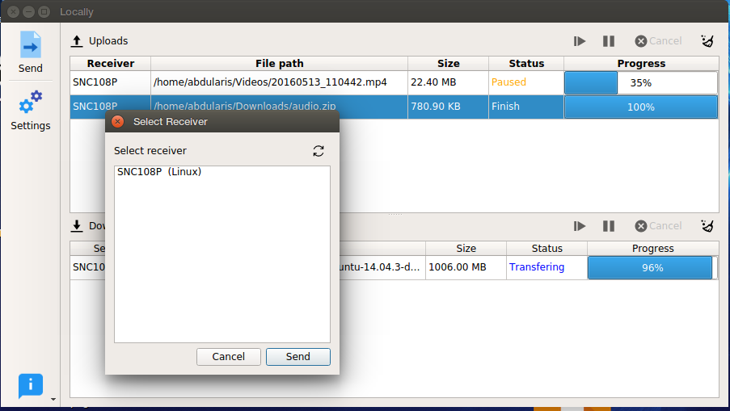
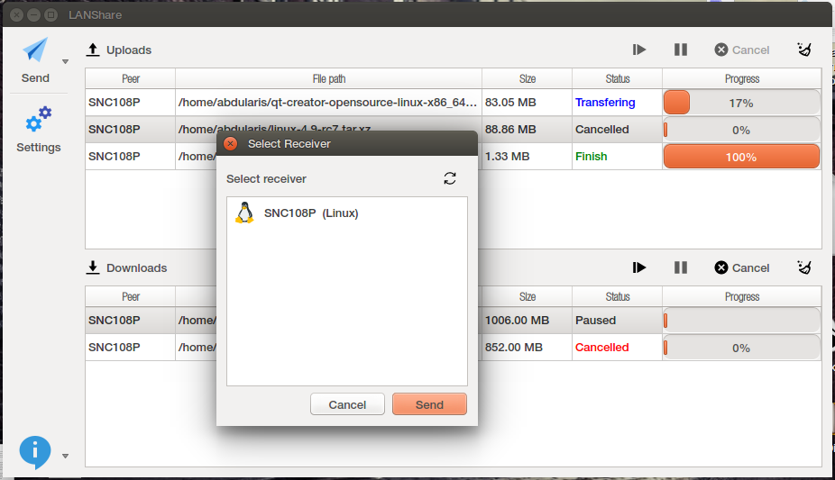
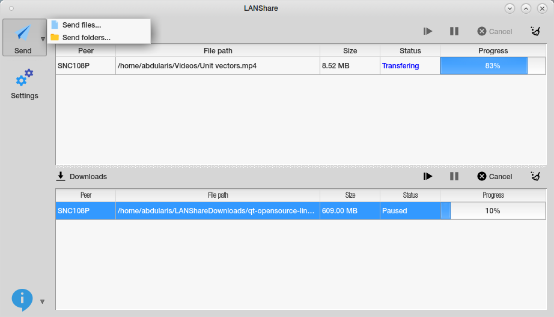

# LAN Share
LAN Share adalah aplikasi file transfer pada jaringan lokal atau LAN (Local Area Network) berbasis GUI dengan menggunakan framework Qt, yang dapat dengan mudah digunakan untuk mentransfer file/banyak file berukuran besar secara langsung tanpa konfigurasi tambahan.

## Features
* Kirim satu atau banyak file.
* Kirim folder atau banyak folder.
* Kirim ke banyak penerima sekaligus.
* Operasi cancel, pause, resume saat transfer file.

## Penggunaan
* Komputer yang digunakan harus sudah terhubung ke sebuah jaringan yang sama (wired atau wireless) seperti jaringan peer-to-peer dsb.
* Jalankan aplikasi ini pada komputer sender/pengirim dan komputer receiver/penerima.
* Pada komputer sender, pilih *Send* (files atau folder) kemudian -> pilih receiver pada dialog *'Select Receiver'* (tunggu sebentar jika list komputer receiver belum tampil) -> kemudian klik *'Send'*.
* File akan secara otomatis diterima pada komputer receiver.

 

 
